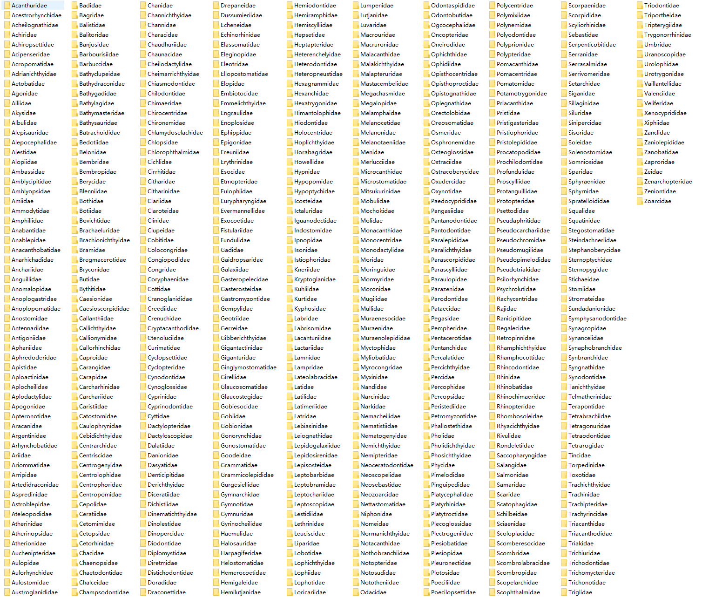
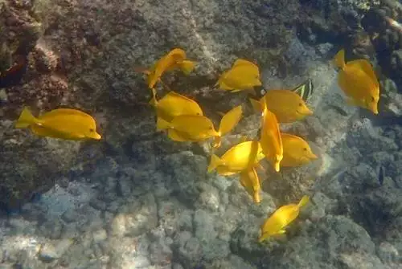
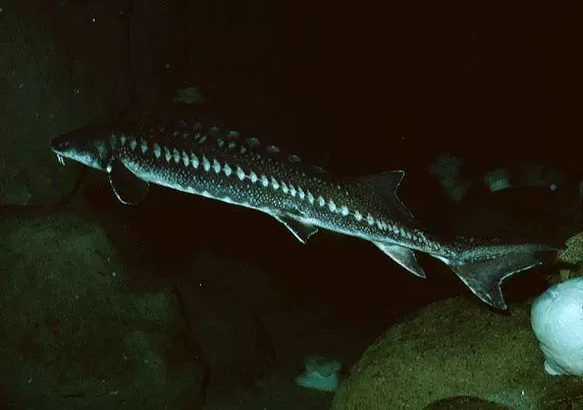
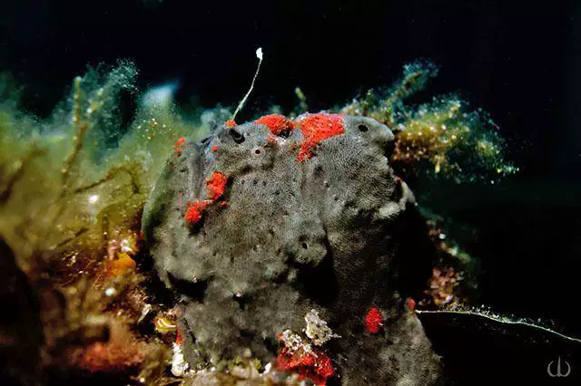
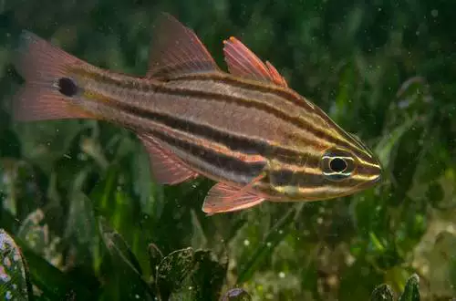
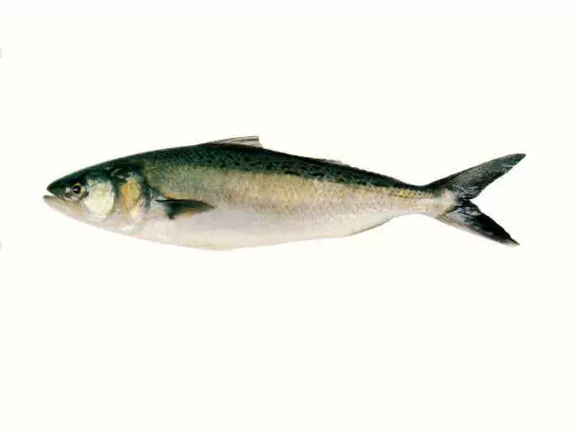

## Body

A large-scale fish taxonomy dataset, consisting of 570 species and 94,532 images.
This benchmark dataset is designed for comprehensive fish identification, detection, and functional trait recognition. Our benchmark dataset is based on aquatic taxonomy, comprising 570 species and 94,532 images.
The dataset is primarily used for bounding box annotations in fish detection. Additionally, the dataset contains 22 features divided into three categories: habitat, ecological rules, and nutritional value. These features aid in identifying the ecological roles of aquatic species and their interactions with other species.
The dataset includes features such as spiny loach, sharp-beaked lipfish, gar, armless gar, sturgeon, glowing grouper, grass carp, eagle rays, anglerfish, mandarinfish, barbel, dolphinfish, side-tailed catfish, flathead, blindspot perch, gurnard, glassnose flounder, mouthbream, four-eyed fish, spineless shark, blackhead bass, longfin shark, butterflyfish, platyfish, wrasse, tiger puffer, scorpionfish, eel, flashing grouper, drillfish, naked barb, jackrabbitfish, eel, silverside, triacanthus, trichiurus, water nymph, ray-finned fish, pike, clownfish, falsetoothfish, angelfish, electric eel, triadfish, pilchards, lanternfish, Antarctic fish, platyfish, mullet, cichlid, herring, goby, tilapia, sandbar croaker, octopus, sea snake, platyfish, deepwater lizardfish, mudfish, angelfish, herring, minnow, dogfish, whitebait, cod, breasted knifefish, garfish, bonito, giant trevally, nurse shark, throat diskfish, shrimpfish, stone loach, shark, ray, garfish, bullhead, sixgill, sixgill catfish, goldfish, flying fish, deepwater shark, lungfish, kingfish, wrasse, shovelfish, red porgy, dogfish, broadnose sucker, cod, platyfish, longnose bream, weak spine fish, electric eel, garfish, soft-bodied fish, longnose flounder, weak spine fish, electric eel, garfish, electric eel, kisser electric eel, whale shark, silverfish, micronemertes, pomfret, mullet, sheepfish, eel, dragonfly shark, electric rays, blindworm, golden threadfish, linemouth eel, duckbill eel, anchovy, box turbot, snake eel, snakefish, posterior anal fin, bone tongue fish, flounder, shark, garfish, swordfish, wrasse, sandperch, bluefin tuna, yellowtail, yamamotosoma, saiwai, sikaguana, scorpionfish, garfish, wrasse, garfish, arrowfish, ray eel, whale shark, silverfish, salmon, spot prawn, silverside, silurus spp., double-crested shark, folding mouthfish, giant mouthfish, pangasius, new silverfish, seahorse, gag grouper.
Electronic virtual products sold are not returnable.

## Images

Here is a pay link on Stripe ( https://buy.stripe.com/3cs8yP7sY87d0vu9AB ). Please contact me lonlonago@foxmail.com after funding $89, and I will send you a complete data files , thank you!

